title: Code Coverage for Vue Applications
author: Gleb Bahmutov
authorTwitter: @bahmutov
tags: vue.js, code coverage
---

Let's take a Vue application scaffolded with [Vue CLI](https://cli.vuejs.org/) like this [vue-calculator](https://github.com/bahmutov/vue-calculator) app. In this blog post, I will show how to instrument the application's source code to collect the code coverage information. We then will use the code coverage reports to guide the end-to-end test writing.

## The application

The example application was forked from [kylbutlr/vue-calculator](https://github.com/kylbutlr/vue-calculator) which used Vue CLI default template during scaffolding. The code is transformed using the following `babel.config.js` file:

```js
// babel.config.js
module.exports = {
  presets: [
    '@vue/app'
  ]
}
```

When we start the application with `npm run serve`, we execute the NPM script

```json
{
  "scripts": {
    "serve": "vue-cli-service serve"
  }
}
```

The application runs at port 8080 by default.

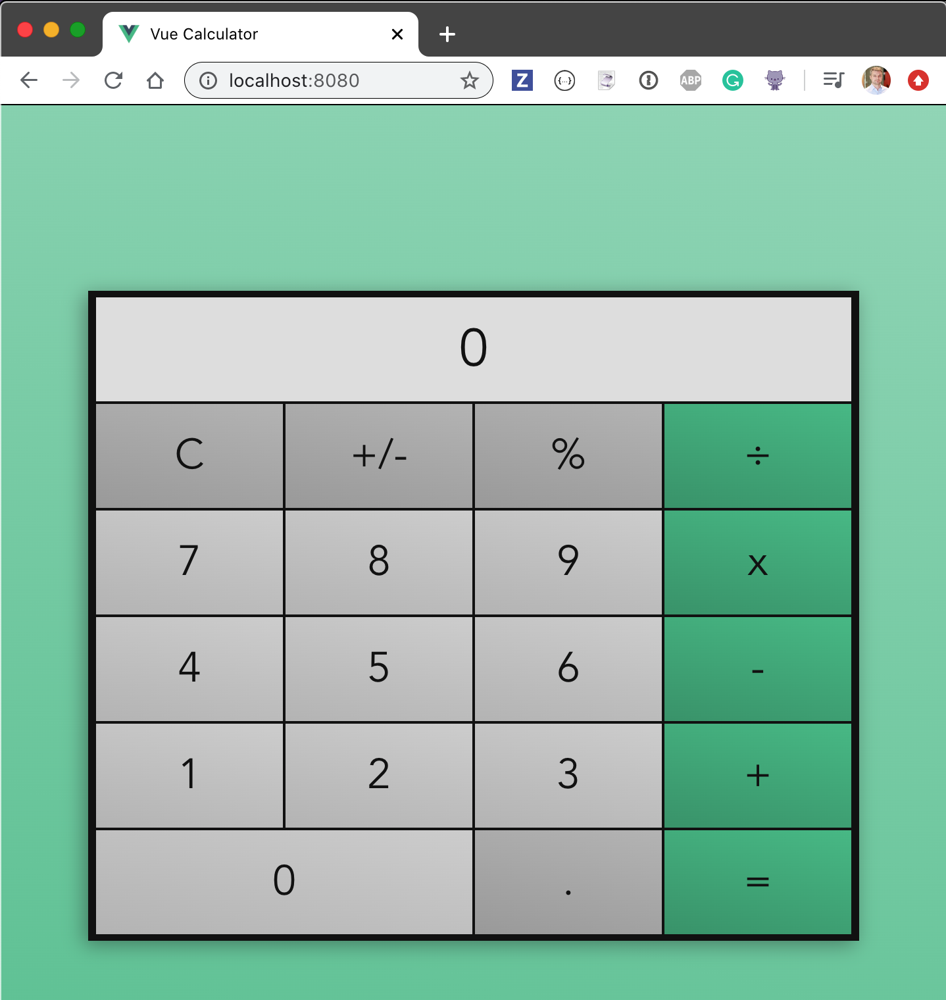

Tada! You can calculate anything you want.

## Instrument source code

We can instrument the application code by adding the `plugins` list to the exported Babel config.The plugins should include the [babel-plugin-istanbul](https://github.com/istanbuljs/babel-plugin-istanbul).

```js
// babel.config.js
module.exports = {
  presets: [
    '@vue/app'
  ],
  plugins: [
    'babel-plugin-istanbul'
  ]
}
```

The application runs, and now we should find the `window.__coverage__` object with counters for every statement, every function, and every branch of every file.

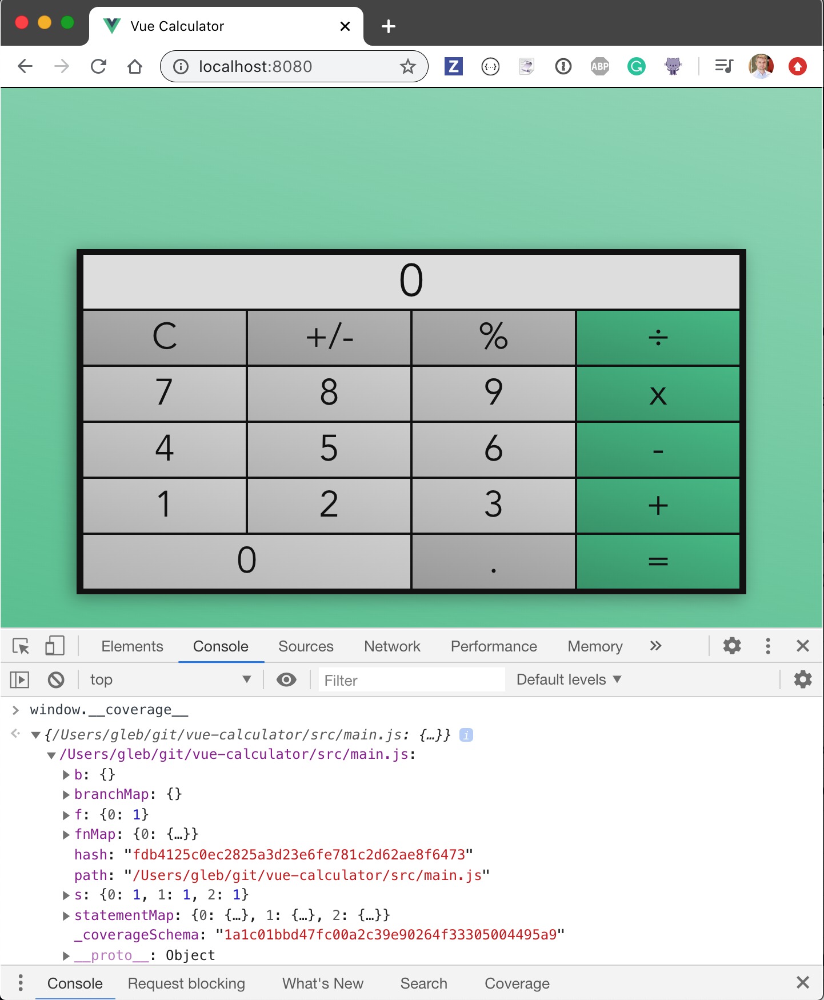

Except the coverage object as shown above, includes only a single entry `src/main.js`, and the coverage object is missing both `src/App.vue` and `src/components/Calculator.vue` files.

Let's tell `babel-plugin-istanbul` that we want to instrument both `.js` and `.vue` files.

```js
// babel.config.js
module.exports = {
  presets: [
    '@vue/app'
  ],
  plugins: [
    ['babel-plugin-istanbul', {
      extension: ['.js', '.vue']
    }]
  ]
}
```

**Tip:** we can place `istanbul` settings in a separate file `.nycrc`, or add them to `package.json`. For now, let's just keep these settings together with the plugin itself.

When we restart the application, we get a new `window.__coverage__` object with entries for `.js` and for `.vue` files.

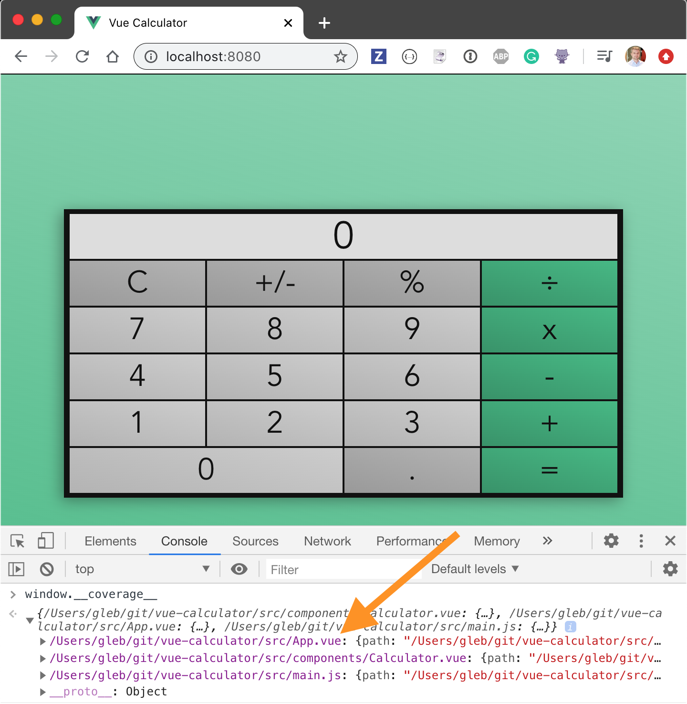

## Conditional instrumentation

If you look at the application's bundle, you will see what the instrumentation does. It inserts counters around every statement, keeping track how many times a statement was executed. There are separate counters for every function and every branch path.

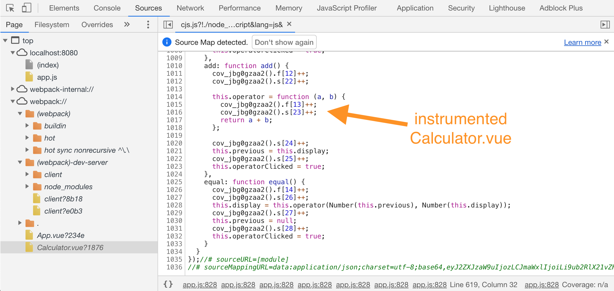

We do not want to instrument the production code. Let's only instrument the code when `NODE_ENV=test` since we will use the collected code coverage to help us write better tests.

```js
// babel.config.js
const plugins = []
if (process.env.NODE_ENV === 'test') {
  plugins.push([
    "babel-plugin-istanbul", {
      // specify some options for NYC instrumentation here
      // like tell it to instrument both JavaScript and Vue files
      extension: ['.js', '.vue'],
    }
  ])
}
module.exports = {
  presets: [
    '@vue/app'
  ],
  plugins
}
```

We can start the application with instrumentation by setting the environment variable.

```shell
$ NODE_ENV=test npm run serve
```

**Tip:** for cross-platform portability use [cross-env](https://github.com/kentcdodds/cross-env) utility to set an environment variable.

## End-to-end Tests

Now that we have instrumented our source code, let us use it to guide us in writing tests. I will install Cypress Test Runner plus its [code coverage plugin](https://github.com/cypress-io/code-coverage) that will convert the coverage objects into human and machine readable reports at the end of the test run. I will also install a handy utility called [start-server-and-test](https://github.com/bahmutov/start-server-and-test) for starting the application, running the tests, and shutting down the app afterwards.

```shell
$ npm i -D cypress @cypress/code-coverage start-server-and-test
+ cypress@4.9.0
+ @cypress/code-coverage@3.8.1
+ start-server-and-test@1.11.0
```

**Note:** you can install Cypress by using the official Vue CLI plugin [@vue/cli-plugin-e2e-cypress](https://cli.vuejs.org/core-plugins/e2e-cypress.html), but I prefer to install the latest Cypress version directly.

In the folder `cypress` I will create two subfolders following the [code-coverage instructions](https://github.com/cypress-io/code-coverage#install)

```js
// file cypress/support/index.js
import '@cypress/code-coverage/support'

// file cypress/plugins/index.js
module.exports = (on, config) => {
  require('@cypress/code-coverage/task')(on, config)
  // IMPORTANT to return the config object
  // with the any changed environment variables
  return config
}
```

Finally, in `cypress.json` file I will place the global settings like the base url to use during tests:

```json
{
  "baseUrl": "http://localhost:8080"
}
```

We can start the application with code instrumentation and open Cypress by using NPM scripts

```json
{
  "scripts": {
    "serve": "vue-cli-service serve",
    "build": "vue-cli-service build",
    "lint": "vue-cli-service lint",
    "dev": "NODE_ENV=test start-test serve 8080 cy:open",
    "cy:open": "cypress open"
  }
}
```

We can place our first end-to-end spec file in `cypress/integration` folder

```js
/// <reference types="cypress" />
describe('Calculator', () => {
  beforeEach(() => {
    cy.visit('/')
  })
  it('computes', () => {
    cy.contains('.button', 2).click()
    cy.contains('.button', 3).click()
    cy.contains('.operator', '+').click()
    cy.contains('.button', 1).click()
    cy.contains('.button', 9).click()
    cy.contains('.operator', '=').click()
    cy.contains('.display', 42)
    cy.log('**division**')
    cy.contains('.operator', '÷').click()
    cy.contains('.button', 2).click()
    cy.contains('.operator', '=').click()
    cy.contains('.display', 21)
  })
})
```

Locally, I will use `npm run dev` command to start the application and open Cypress. The above test passes quickly. Our calculator seems to add and divide numbers just fine.

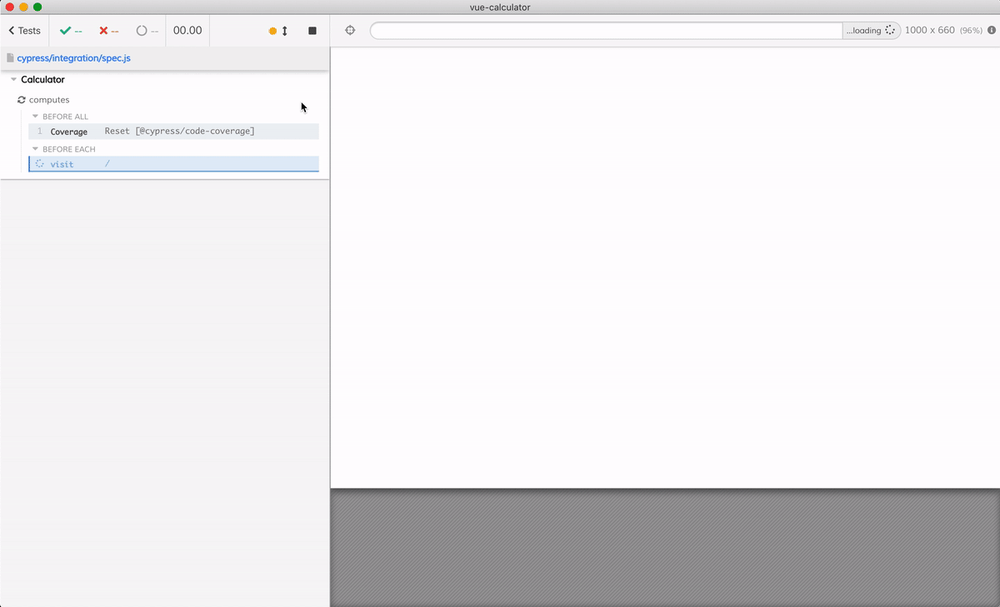

The code coverage plugin automatically generates code coverage reports at the end of the run, as you can see from the messages in the Command Log on the left of the Test Runner. The reports are stored in the folder `coverage`, and by default there are several output formats.

```text
coverage/
  lcov-report/
    index.html         # human HTML report
    ...
  clover.xml           # coverage report for Clover Jenkins reporter
  coverage-final.json  # plain JSON output for reporting
  lcov.info            # line coverage report
                       # for 3rd party reporting services
```

While working with tests locally, I prefer opening the HTML coverage report

```shell
$ open coverage/lcov-report/index.html
```

The `index.html` is a static page that shows a table for each source folder with coverage information.

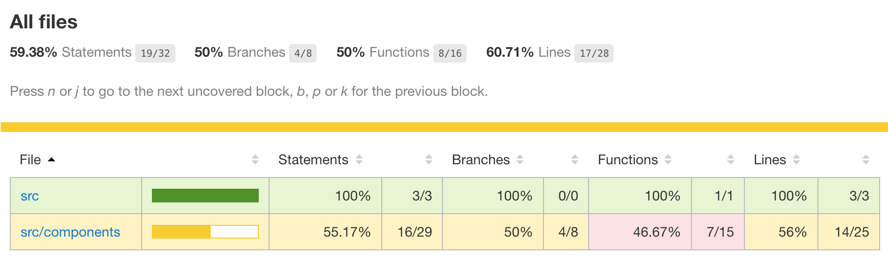

**Tip:** store the entire `coverage/lcov-report` folder as a test artifact on your Continuous Integration (CI) server. Then browse or download the report to see the collected code coverage after the test run.

End-to-end tests are _effective_. With a single test that loads and interacts with the entire application we have covered 60% of the source code. Even better, by drilling down to the individual files, we discover in `src/components/Calculator.vue` the features we have not tested yet.

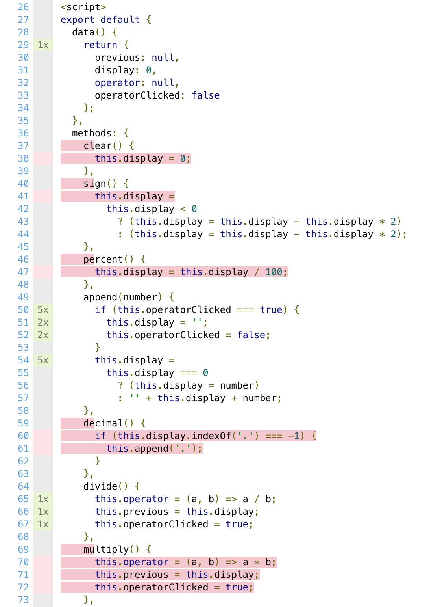

The source lines highlighted in red are the lines missed by the test. We can see that we still need to write a test that clears the current number, changes the sign, sets the decimal point, multiplies, etc. But we did test entering and dividing numbers. The test writing thus becomes following the code coverage as a guide to writing end-to-end; add tests until you hit all lines marked in red!

```
  Calculator
    ✓ computes adds and divides (1031ms)
    ✓ multiplies, resets and subtracts (755ms)
    ✓ changes sign (323ms)
    ✓ % operator (246ms)
```

As we write more tests we quickly gain coverage and confidence in our application. In the last test we will cover the `decimal () { ... }` method that remained red so far.

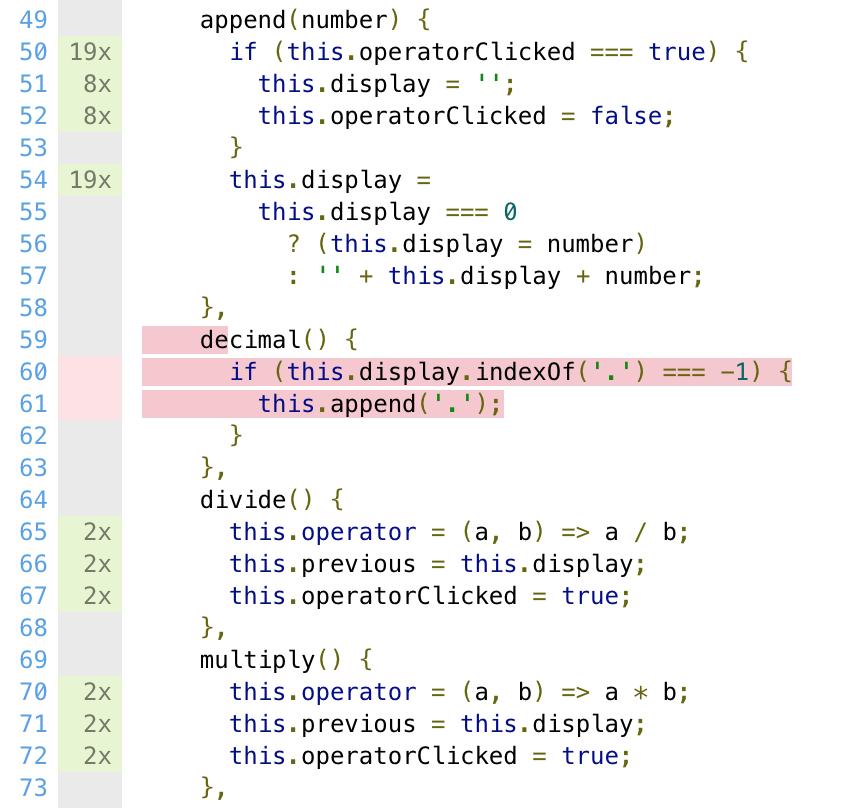

The test below types a single digit number and clicks the "." button. The display should show "5.".

```js
it('decimal', () => {
  cy.contains('.button', '5').click()
  cy.contains('.button', '.').click()
  cy.contains('.display', '5.')
})
```

Hmm, this is weird, the test fails.

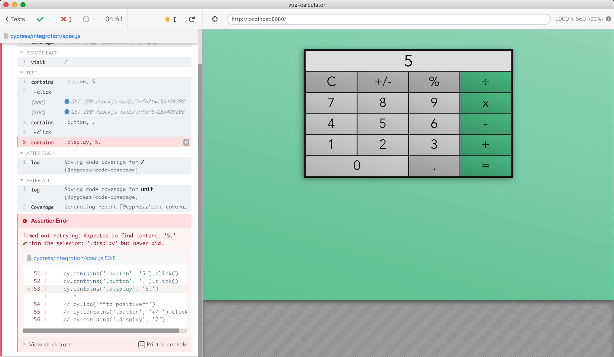

A power of Cypress test is that it runs in the real browser. Let's debug the failing test. Put a breakpoint in the `src/components/Calculator.vue`

```js
decimal() {
  debugger
  if (this.display.indexOf(".") === -1) {
    this.append(".");
  }
},
```

Open the DevTools in the browser and run the test again. It will run until it hits the `debugger` keyword in the application code.

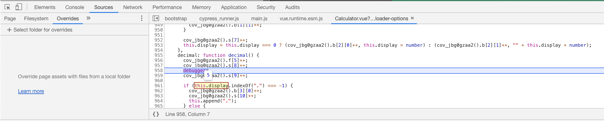

Ohh, the `this.display` is a Number, not a String. Thus `.indexOf()` does not exist and the expression `this.display.indexOf(".")` throws an error.

**Tip:** if you want Cypress tests to fail any time Vue catches an error, set the following in your code application code:

```js
// exclude these lines from code coverage
/* istanbul ignore next */
if (window.Cypress) {
  // send any errors caught by the Vue handler
  // to the Cypress top level error handler to fail the test
  // https://github.com/cypress-io/cypress/issues/7910
  Vue.config.errorHandler = window.top.onerror
}
```

Let's fix the logical error in our code:

```js
decimal() {
  if (String(this.display).indexOf(".") === -1) {
    this.append(".");
  }
},
```

The test passes. Now the code coverage report tells us that the "Else" path of the condition has not been taken yet.

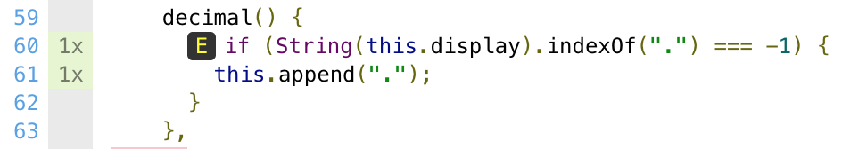

Extend the test to click the "." operator twice during the test and it will cover all code paths and turn the entire method coverage green.

```js
it('decimal', () => {
  cy.contains('.button', '5').click()
  cy.contains('.button', '.').click()
  cy.contains('.display', '5.')
  cy.log('**does not add it twice**')
  cy.contains('.button', '.').click()
  cy.contains('.display', '5.')
})
```

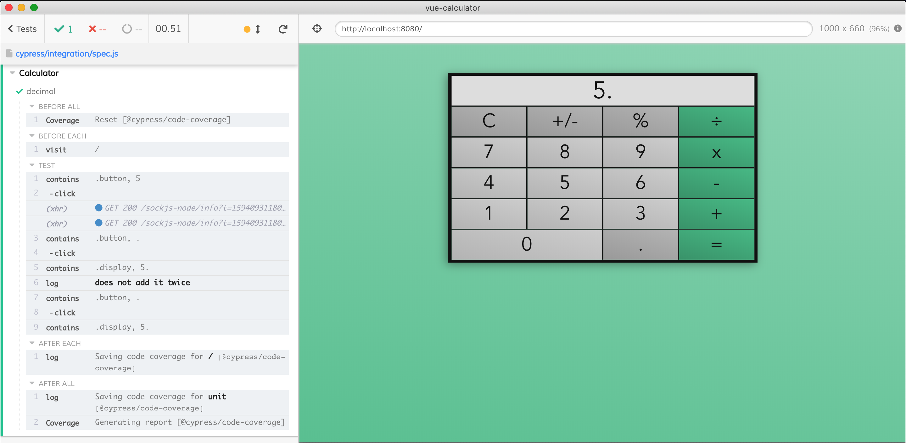

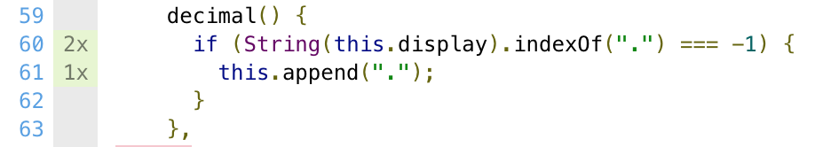

Now let's run all tests again. All tests pass in less than 3 seconds

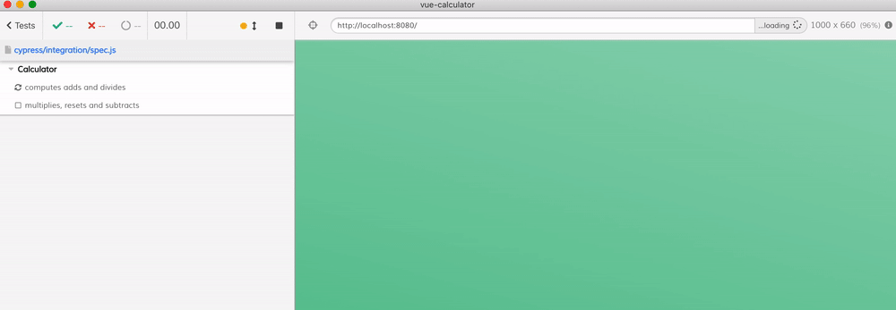

And the tests together cover our entire code base.

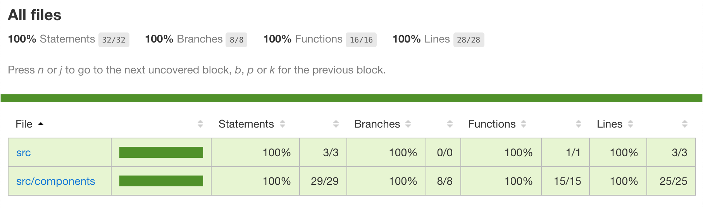

## Conclusions

- adding code instrumentation to Vue projects is simple if the project is already using Babel to transpile the source code. By adding the `babel-plugin-istanbul` to the list of plugins you get the code coverage information under `window.__coverage__` object.
- you probably want to only instrument the source code while running tests to avoid slowing down the production build
- end-to-end tests are very effective at covering a lot of code because they exercise the full application.
- the code coverage reports produced by `@cypress/code-coverage` plugin can guide you in writing tests to ensure all features are tested

For more information read the [Cypress code coverage guide](https://on.cypress.io/code-coverage) and [@cypress/code-coverage](https://github.com/cypress-io/code-coverage) documentation.
